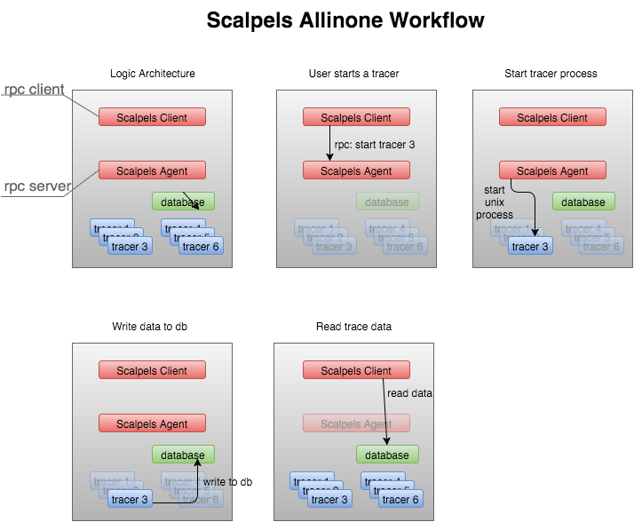
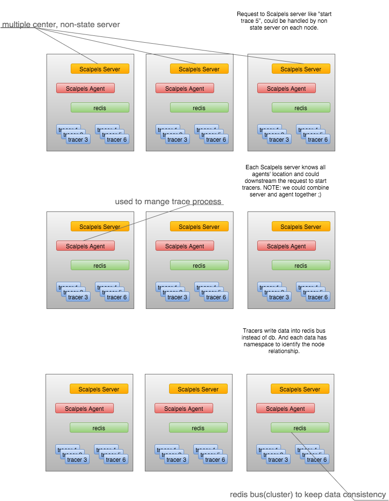
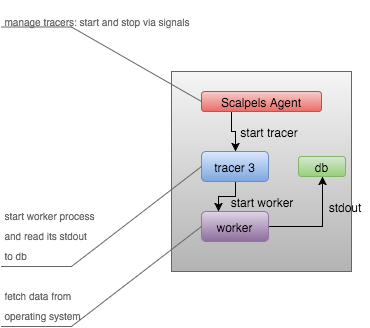

Scalpels
========
Scalpels is a distributed tracing or debuging system for OpenStack.

Background
==========
OpenStack is made of multiple Python-based projects. Each project has similiar but different architecture. Scalpels intergates some useful scripts or 3rd tools to help operator track system status in your cloud environments.

Contribute
==========
This project is a prototype now and is under development. If you have interests in this work, please contact @kun_huang, at #openstack-chinese channel.

Mission
=======
Scalpels is a kind of "debugfs" for OpenStack. It gathers data from number of tracers like proc or systemtap which could be used to quantize preformance under workloads.

Single Node Architecture
========================
This type of deployment is used as POC in OpenStack community CI.

   :alt: All-in-One deployment

In All-In-One scenario, Scalpels Client works as rpc client, Scalpels Agent works as rpc server. When Scalpels Agent receives a rpc to start tracer 3, it will start a unix process for tracer 3, which can write data to database. Scalpels Client can read data from database directly.

Multiple Node Architecture
==========================
This is under Designing:

In multiple node scenario, Scalpels Server are non-state servers, they are distributed in multiple nodes, each Scalpels Server knows all agents' location and could forward the request to start tracers.

Scalpels Agent is introduced to manage trace process, it can be combined with Scalpels server during implementation.

Tracers can write data into redis bus instead of database to keep data consistency.

Agent-Tracer-Worker
===================
The relationship is:

Scalpels Agent: manager tracers by start/stop signals.
Tracer: Start worker process and write its stdout to database.
Worker: It fetches data from operating system.

Ideas
=====
Each project will have scripts working:

* on python calls
* on sql queries
* on filesystem I/O
* on RPC calls if need
* on necessary system calls
* on common system statistics
